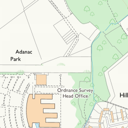
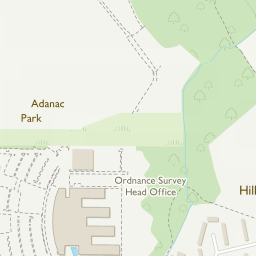
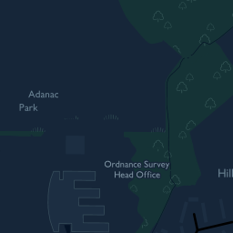

# MapKit Adapter for OS Maps API
This is a simple example `MKTileOverlay` subclass that can be used to access
the Ordnance Survey Maps API.

### Getting Started
You will need an API key from Ordnance Survey to use this sample.
```
printf "your-api-key" > APIKEY
```
Please ensure your APIKEY file doesn't have a trailing new line.

### Using in your own project
Easiest way to use this framework is using carthage. Add
```
github "OrdnanceSurvey/os-mapkit-adapter"
```
to your Cartfile

## OSMapKitAdapter.framework
This framework contains an `MKTileOverlay` subclass that fetches its content
from the OS Maps API, along with an enum describing the map products that can
be used.

### `OSMapProduct`
The product options available. These products look like the tiles below:

`OSMapProductRoad`<br/>


`OSMapProductOutdoor`<br/>


`OSMapProductLight`<br/>


`OSMapProductNight`<br/>


### `OSTileOverlay`
This is the tile overlay subclass to use. Simply initialise is with your API
key and the product you wish to view:

```objc
    OSTileOverlay *tileOverlay = [[OSTileOverlay alloc] initWithAPIKey:@"API-KEY"
                                                               product:OSMapProductOutdoor];
```
```swift
    let tileOverlay = OSTileOverlay(APIKey: apiKey, product: .Road)
```

add it to your map view
```
    [mapView addOverlay:tileOverlay];
```

You will also need to implement the map view delegate method
`mapView:rendererForOverlay:`
```
- (MKOverlayRenderer *)mapView:(MKMapView *)mapView rendererForOverlay:(id<MKOverlay>)overlay {
    if ([overlay isKindOfClass:MKTileOverlay.class]) {
        return [[MKTileOverlayRenderer alloc] initWithTileOverlay:overlay];
    } else {
        return [[MKOverlayRenderer alloc] initWithOverlay:overlay];
    }
}
```

### Limiting the map view to the bounds of the UK
`MKMapView` wants to show the whole world. Unfortunately there is no easy
way to limit the map to only show the UK and the zoom levels supported by
the OS Maps API. The only way is to respond to changes of region and reset
it back to a supported area. There is an object in the framework,
`OSMapViewRegionRestriction` which can help with this. Simply initialise an
instance of this class, and pass your map view to this instance in
`mapView:regionDidChangeAnimated:`
```
- (void)mapView:(MKMapView *)mapView regionDidChangeAnimated:(BOOL)animated {
    [self.restriction updateMapViewRegionIfRequired:mapView];
}
```
A radar has been filed with apple for an enhancement to make this nicer and
easier. Feel free to duplicate it if you're interested. You can see what we
filed [here](RegionLimitFeatureRequest.md)
